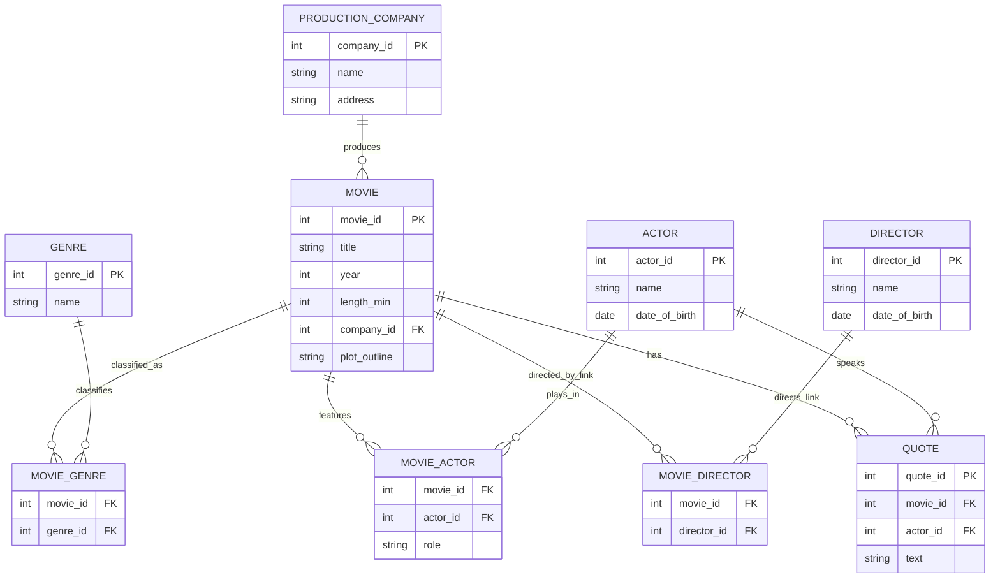

# ER Diagram

Rendered with Mermaid (GitHub/VS Code preview will draw it automatically).

## Cardinality notes
- **Movie — ProductionCompany:** many-to-one (each movie has exactly one production company; one company has many movies).
- **Movie — Genre:** many-to-many (`MOVIE_GENRE`).
- **Movie — Actor:** many-to-many with attribute `role` (`MOVIE_ACTOR`). An actor can have several roles in the same movie — the PK is `(movie_id, actor_id, role)`.
- **Movie — Director:** many-to-many (`MOVIE_DIRECTOR`). A director may also appear in `MOVIE_ACTOR` for the same movie (directors can act).
- **Quote — Movie/Actor:** each quote belongs to one movie and is spoken by one actor who appears in that movie.
